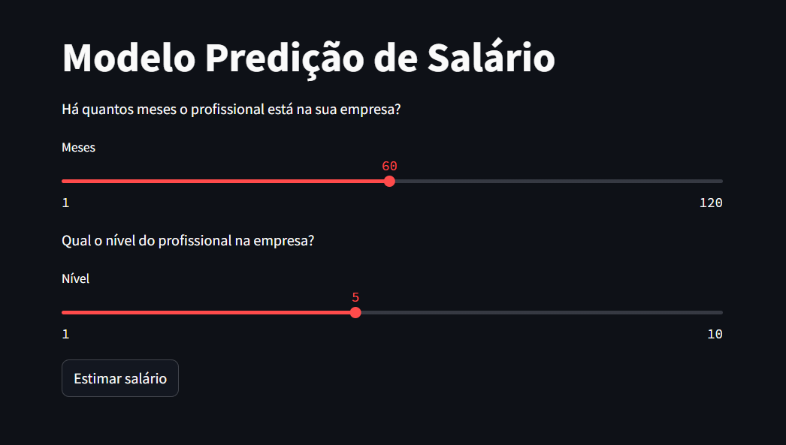

# REGRESSÃO POLINOMIAL

```
python -m venv venv
.\venv\Scripts\activate
pip install -r requirements.txt
```

Rodar os sequintes comandos em terminais separados:

```
uvicorn api_modelo_salario:app --reload
streamlit run app_streamlit_salario.py
```

